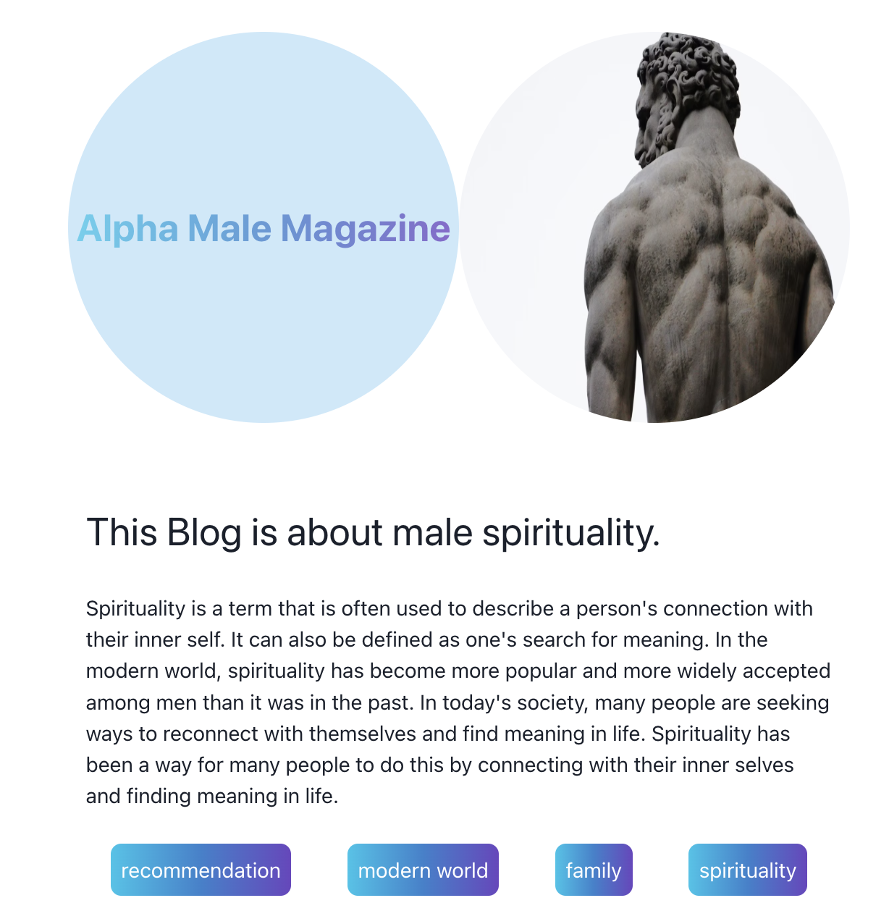

# Alpha Male Magazine Frontend - A Platform for Male Spirituality



## Project Overview
Alpha Male Magazine is a modern web platform focused on male spirituality and personal development. The project consists of a React-based frontend application that connects to a separate Node.js backend API.

## Live Demo
The project is deployed and can be viewed at [https://alpha-male-mag.netlify.app/](https://alpha-male-mag.netlify.app/)

## Features
- Dynamic article management system
- Author profiles and biographies
- Light/Dark mode toggle
- Responsive design for all devices
- Newsletter subscription functionality
- Social media integration
- Modern and clean user interface

## Technologies Used
### Frontend
- React.js
- Chakra UI
- React Router DOM
- React Icons
- Emotion (for styling)
- JavaScript ES6+

### UI/UX
- Responsive design
- Custom CSS
- Chakra UI components
- Dynamic color modes

## Getting Started

### Prerequisites
- Node.js
- npm
- Backend API running (see related repositories)

### Installation
1. Clone the repository
   ```bash
   git clone https://github.com/yourusername/Alpha-Male-Magazine-Frontend.git
   ```
2. Install dependencies
   ```bash
   npm install
   ```
3. Set up environment variables
   Create a `.env` file with:
   ```
   REACT_APP_PRODUCTION_URL=your_production_api_url
   REACT_APP_DEVELOPMENT_URL=your_development_api_url
   ```
4. Start the development server
   ```bash
   npm start
   ```
   The application will open at [http://localhost:3000](http://localhost:3000)

## Project Structure
```bash
alpha-male-magazine-frontend/
├── src/
│ ├── img/
│ ├── components/
│ │ ├── About.js
│ │ ├── AllArticles.js
│ │ ├── Article.js
│ │ ├── Authors.js
│ │ ├── Footer.js
│ │ ├── Header.js
│ │ └── Hero.js
│ ├── App.js
│ ├── serverURL.js
│ └── index.js
├── public/
└── README.md
```

## Related Repositories
- Backend API: [Alpha-Male-Magazine-node-BE](https://github.com/eikemx/Alpha-Male-Magazine-node-BE)

## Scripts
- `npm start`: Runs the development server
- `npm build`: Builds the production application
- `npm test`: Runs the test suite
- `npm eject`: Ejects from Create React App

## Features in Detail
1. **Article Management**
   - Display of featured articles
   - Full article view
   - Article summaries and previews

2. **Author Profiles**
   - Author biographies
   - Author image galleries
   - Associated articles

3. **User Interface**
   - Responsive design
   - Dark/Light mode toggle
   - Modern gradient text effects
   - Clean navigation

4. **Newsletter Integration**
   - Email subscription form
   - Submission confirmation

## Contact
- GitHub: [@eikemx](https://github.com/eikemx)
- LinkedIn: [Eike Merx](https://www.linkedin.com/in/eike-merx-50b111216/)
- XING: [Eike Merx](https://www.xing.com/profile/Eike_Merx/web_profiles)

## Acknowledgments
- WBS Coding School
- Project collaborator: tognut86

---
*This project was created as part of the WBS Coding School Bootcamp curriculum.*